# Nodus

**Supply-chain blast radius, computed as a graph in HydraDB.**

Track 2A, problem A.

A package is compromised at 09:00. Two questions decide what happens next:
**which of your services are exposed**, and **does your code actually run the
poisoned dependency**. `npm audit` answers a narrow version of the first for one
repository. Nodus answers both, across a fleet of repositories, and tells you
which alerts you can safely ignore.

Everything in this project is built on one idea: dependency risk is a
reachability problem, reachability problems are graph problems, and so the whole
system is a graph stored in HydraDB with every question expressed as a traversal
over it.

---

## Contents

1. [The problem](#1-the-problem)
2. [The solution in one picture](#2-the-solution-in-one-picture)
3. [The graph model stored in HydraDB](#3-the-graph-model-stored-in-hydradb)
4. [Where HydraDB is used](#4-where-hydradb-is-used)
5. [How the graph is built](#5-how-the-graph-is-built)
6. [How a question is answered](#6-how-a-question-is-answered)
7. [Feature by feature](#7-feature-by-feature)
8. [The assistant](#8-the-assistant)
9. [Designing around HydraDB's constraints](#9-designing-around-hydradbs-constraints)
10. [Measured results](#10-measured-results)
11. [Running it](#11-running-it)
12. [Repository layout](#12-repository-layout)
13. [Testing](#13-testing)
14. [Known limits](#14-known-limits)

---

## 1. The problem

The npm ecosystem is a graph of tens of millions of versioned packages. When one
of them is compromised, the interesting question is not "is this package bad".
Somebody else already answered that. The interesting questions are local to you:

| Question | What a flat scanner says | What is actually true |
|---|---|---|
| Which services have it? | One repository at a time | It spreads across a fleet, mostly transitively |
| How deep is it? | Nothing | It arrived through a chain you never chose |
| Does our code run it? | Nothing | Almost all installed packages are never imported |
| What do we fix first? | Everything is severity-coloured | Only a few alerts can actually execute |
| Where does it spread next? | Nothing | Publish rights, not dependencies, are how worms move |

The last two matter most during an incident. A team looking at forty alerts at
09:06 needs to know which thirty they can defer, and no lockfile scan can tell
them, because the answer is not in the lockfile. It is in the source code.

### The insight that makes it tractable

The problem statement suggests traversing the whole npm ecosystem graph. We do
not build that graph, because we do not need it.

**A `package-lock.json` v3 already is a fully resolved dependency graph.** Every
entry under `packages` names its own resolved dependencies, at exact versions,
with no ranges left to solve. Scanning a fleet of repositories therefore yields
an exact dependency graph with no registry crawl, no semver re-resolution and no
approximation. What we load into HydraDB is small, exact and entirely about you.

---

## 2. The solution in one picture

Nodus builds **two graphs and one bridge** inside HydraDB.

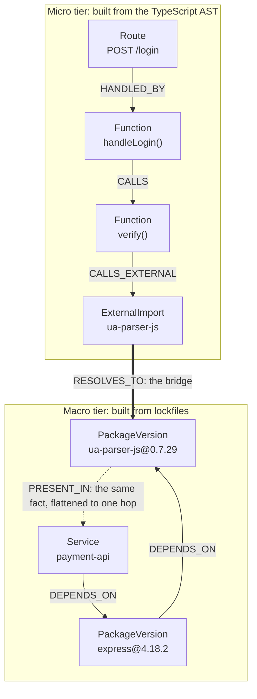

The macro tier says **you have it**. The micro tier says **an HTTP request can
reach it**. Those are very different incidents, and keeping them as separate
tiers joined by one bridge is what lets Nodus grade an alert instead of just
reporting it.

Both tiers, the bridge, and every identity and provenance relationship live in
one HydraDB graph. Nothing is held in a second database, a cache layer or an
in-memory index that could disagree with it.

### The severity tiers this produces

| Tier | Meaning | Action |
|---|---|---|
| **P0 CONFIRMED** | Exposed, and a persistence artifact is on disk. The worm wrote into `.claude/` or `.vscode/`, so `npm uninstall` does not clear it. | Manual cleanup |
| **P1 REACHABLE** | Exposed, and an HTTP route reaches the calling function. | Patch now |
| **P2 IMPORTED** | Exposed and imported from source, but no route path found. | Patch soon |
| **P3 INSTALLED** | In the lockfile, never imported. | Safe to deprioritise |

P3 is not filler. On the corpus as currently ingested, 1,418 resolved package
versions sit behind 4 external imports. Almost nothing in a dependency tree is
ever named by a line of your code. Telling a team which alerts fall into P3 is
where most of the saved time in a real incident comes from, and it is the one
thing a flat lockfile scan structurally cannot do.

### What it looks like

The whole graph, live out of HydraDB: 2,834 nodes and 8,828 edges, every circle
a real thing the ingest wrote. Colour is not decoration. Red is what is known to
be wrong, violet is what you own and could lose, cyan is what a compromise
travels through, and amber is who could publish the next one.

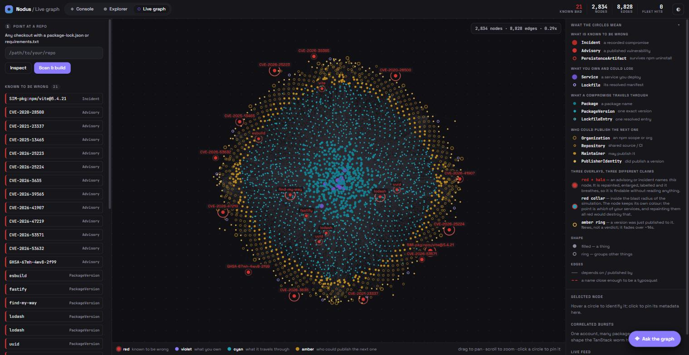

Select the compromised version and everything unrelated drops away, leaving the
one edge that matters. This is the blast radius: the incident, the version it
names, and the path from there into the fleet.

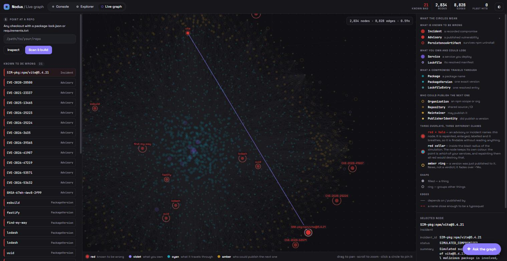

---

## 3. The graph model stored in HydraDB

Everything below is written into HydraDB by the ingest and read back by queries.
The single source of truth for labels, edge types and id ranges is
[`blastradius/schema.py`](blastradius/schema.py).

**Who a package is, and what is known to be wrong with it.** This half is
ecosystem-wide: it describes npm, not your fleet.

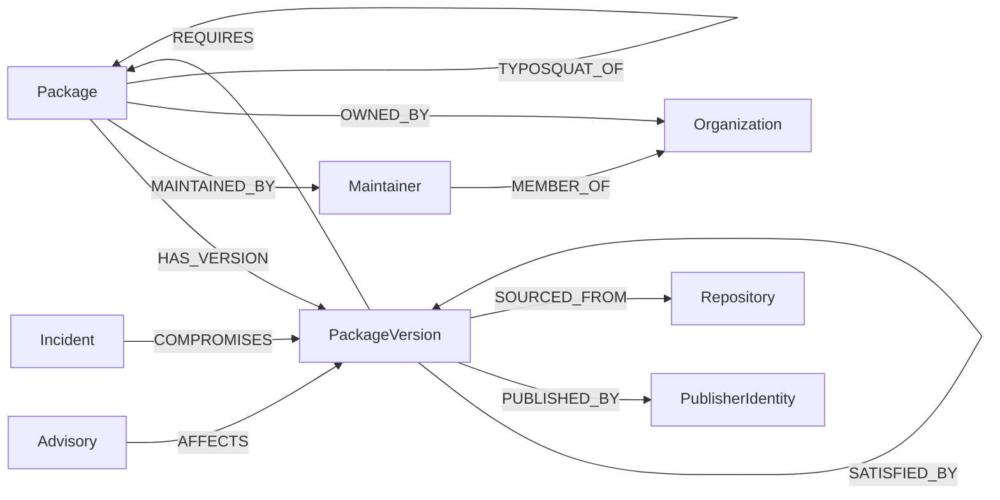

**What your fleet installed, and what your code does with it.** This half is
yours: it is built entirely from your lockfiles and your source.

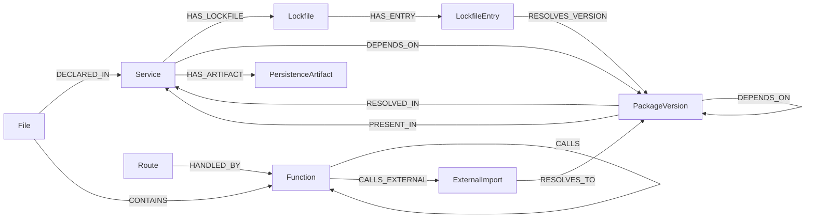

`PackageVersion` is the node both halves share, which is what makes the join
possible at all. Neither diagram draws the materialised inverse edges; section 9
explains why they exist.

Clicking one of those nodes in the live graph shows the model as it is actually
stored. Here is `lodash@4.17.20`: the properties the ingest wrote, and the edge
counts underneath it, one per relationship. `PUBLISHED_BY` and `SOURCED_FROM`
are the provenance half, `RESOLVED_IN` is the flattened closure that answers
which of your services hold it, and `AFFECTS 3` is three advisories pointing at
this exact version.

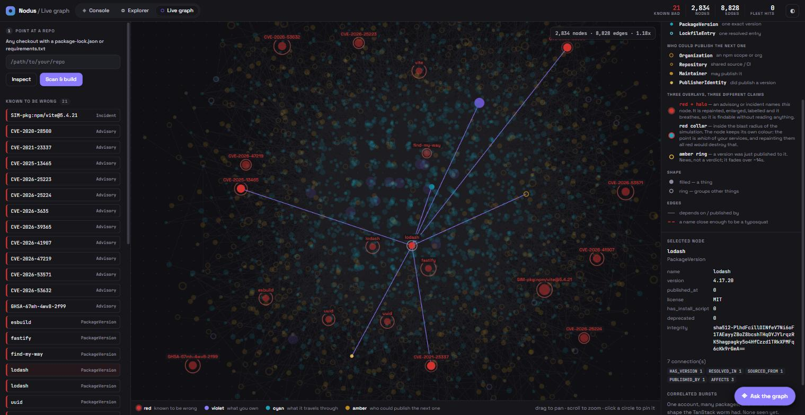

### The three claims Nodus refuses to merge

Most tools collapse "this range mentions the package" and "this lockfile
installed the package" into one number. Nodus stores them as three different
edges with three different evidence strengths, because the difference is the
whole accuracy claim:

| Edge in HydraDB | What it proves | Evidence |
|---|---|---|
| `REQUIRES` | A declared range names the package | POSSIBLE |
| `SATISFIED_BY` | The range provably admits this exact version | POSSIBLE_EXACT |
| `RESOLVES_VERSION` | A lockfile actually selected this version | **CONFIRMED** |

`^4.17.21` and `^4.17.0` both admit `lodash@4.17.21`. Only one of them is what
your build installed. A tool that cannot tell those apart over-reports, and an
over-reporting security tool is one people learn to ignore.

Advisories and incidents are likewise kept apart. `Advisory -AFFECTS->` means
**vulnerable**; `Incident -COMPROMISES->` means **tampered**. A decade-old
low-severity CVE outranking an active compromise is precisely the failure that
makes a security dashboard ignorable, so they are different node types on
different scales.

### One key per thing

Ids in HydraDB are allocated per `(label, natural key)` by
[`blastradius/ids.py`](blastradius/ids.py), and every key is built by
[`blastradius/pkg/identity.py`](blastradius/pkg/identity.py) following the
Package URL spec: `pkg:npm/lodash@4.17.21`, `pkg:pypi/h11@0.16.0`.

This is a correctness boundary, not tidiness. The two ingest paths once
disagreed. `vite@6.3.6` from the lockfile loader and `pkg:npm/vite@6.3.6` from
the package tier became two unconnected HydraDB nodes for every package version
in the repository. Advisories attached to one copy, the dependency tree to the
other, nothing errored, and the product reported a clean
bill of health for a repository with 96 advisories in it. The ecosystem is part
of the key for the same reason: npm's `requests` and PyPI's `requests` are
unrelated projects.

---

## 4. Where HydraDB is used

HydraDB is not a storage detail here. It is the execution engine. Every question
the product answers is a HydraDB query, and the data model was designed around
what HydraDB's query planner accepts.

| Capability | What HydraDB does | Code |
|---|---|---|
| **Store both graph tiers** | 16 node labels and 45 edge types, written with `UNWIND` + `MERGE` by id | `ingest/load.py`, `pkg/writer.py` |
| **Which services are exposed** | One pinned-id hop over the `RESOLVED_IN` closure stored in HydraDB, 3.0 ms | `pkg/blast.py` |
| **Why do we have this package** | `algo.MSpaths` resolved inside the HydraDB engine, not reassembled client-side | `query/blast.py` |
| **Show me the chain** | `algo.SSpaths` over `SATISFIES` and the `RESOLVED_IN` closure, run only for the node a user opens | `pkg/blast.py` |
| **Does our code reach it** | Forward walks from `ExternalImport` over `IMPORT_USED_BY` and `CALLED_BY` in HydraDB | `query/codereach.py` |
| **Heat map of the whole tree** | Bulk edge reads from HydraDB, graded in Python from a single edge set | `query/exposure.py` |
| **Blast frontier** | Three one-hop HydraDB queries over `PUBLISHED_BY`, `MAINTAINED_BY`, `SOURCED_FROM` | `pkg/frontier.py` |
| **Who published this** | Pinned lookups over `PUBLISHED_BY` and `MAINTAINED_BY` in HydraDB | `chat/tools.py` |
| **Whole-graph map** | Label scans plus nine unpinned edge sweeps, cached on `read_epoch` | `pkg/fullgraph.py` |
| **Incident simulation** | Writes an `Incident` node and `COMPROMISES` edge into HydraDB, then retracts it | `pkg/incident.py` |
| **Cache invalidation** | HydraDB's monotonic `read_epoch` is the cache key for every derived payload | `hydra_client.py` |
| **Chatbot facts** | Every fact the assistant is allowed to state comes from a HydraDB query | `chat/tools.py` |
| **Scale measurement** | Synthetic graphs up to 500,000 versions written to and timed through HydraDB | `pkg/scale.py` |

The client is [`blastradius/hydra_client.py`](blastradius/hydra_client.py): the
HTTP JSON API by default, with a Bolt session available for bulk loads. It
handles HydraDB's typed cell format (`{"type": "string", "value": "lodash"}`),
cursor pagination, `UNWIND` batching and the admission-control runtime ceiling.

**`read_epoch` deserves a specific mention.** HydraDB returns a monotonic read
snapshot with every query result, and it advances only when writes land. That
makes it a free, correct cache key: the whole-graph map, the Explorer's micro
view and the chatbot's briefing are all cached against it, so an ingest
invalidates every derived payload automatically without a single invalidation
message being written anywhere.

---

## 5. How the graph is built

One command turns a repository into a fully populated HydraDB graph:

```powershell
python -m blastradius.cli pipeline --reset
```

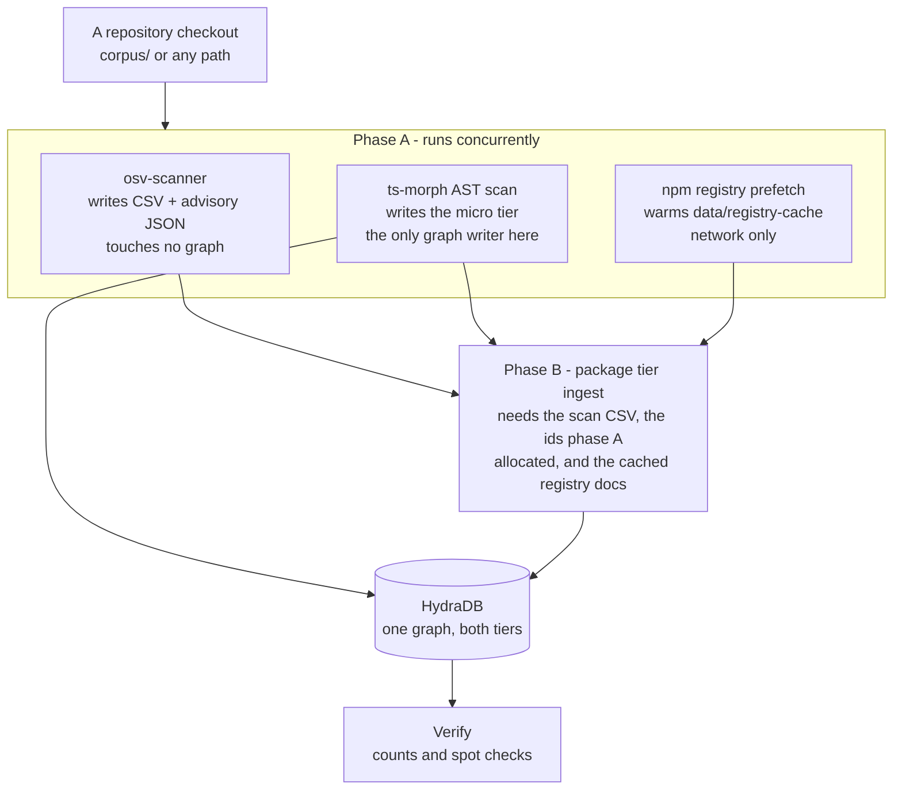

The split is drawn along **what each stage writes**, not along what would be
convenient. Exactly one member of phase A writes to HydraDB and exactly one
writes the id map, so there is no lock to contend for and no ordering to get
wrong. The package tier cannot join phase A because it genuinely depends on all
three. Starting it early would mean ingesting advisories the scan had not
finished finding.

The prefetch is the stage that pays for itself. The package tier spends most of
its time waiting on the npm registry, and those documents are keyed by package
name, which the lockfiles already give us before any advisory is known. On a
cold cache that stage alone was about 11 seconds of a 19 second run.

`--sequential` turns the overlap off, which is worth more than the saved seconds
when a stage is failing and you need to see it in a straight line.

### Where the vulnerabilities come from

They are scanned, not hand-written. `osv_scanner_tool/` drives Google's
`osv-scanner` over the repository and `blastradius/pkg/osvscan.py` turns the
findings into the two inputs the graph consumes: a CSV that becomes `Advisory`
nodes and `AFFECTS` edges in HydraDB, and advisory JSON files that the micro
tier resolves against exact versions.

**Ground truth is the resolved version, never the manifest.** An unpinned range
in `package.json` resolves to whatever is newest, which is usually the *safe*
version, so scanning manifests reports vulnerabilities in versions nobody
installs and misses the ones they do. The scan reads `package-lock.json`, which
is already resolved.

If `osv-scanner` is not on the machine, the scan falls back to resolving the
lockfiles locally and asking `api.osv.dev` about the exact resolved versions.
Same advisories, one network hop. `python -m blastradius.cli doctor` reports
which path you are on.

---

## 6. How a question is answered

Take the headline question: *`ua-parser-js@0.7.29` is compromised. What now?*

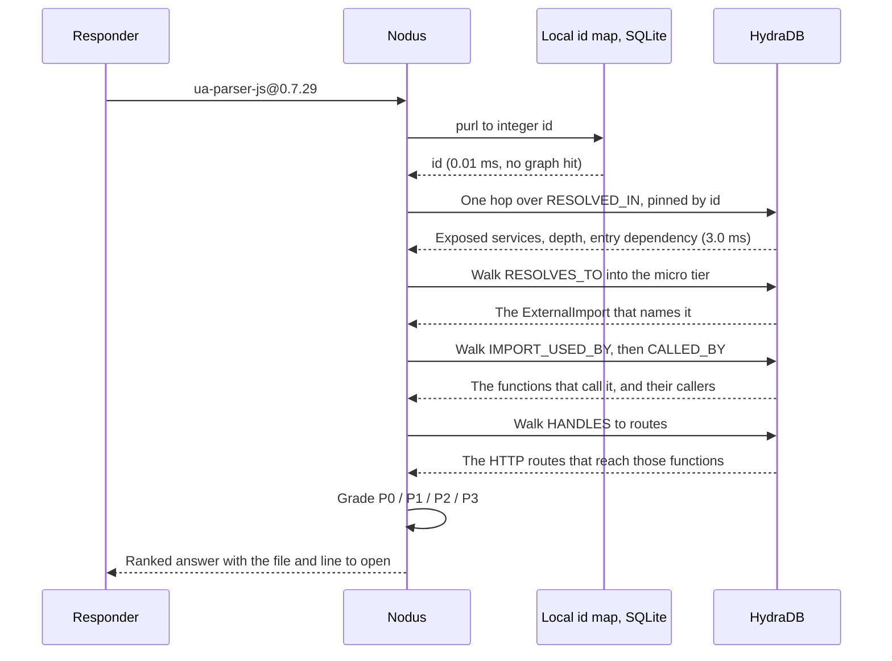

Three design choices are visible in that sequence.

**Names resolve locally, before HydraDB is touched.** Looking a package name up
by property would be a label scan, and HydraDB has no index behind `p.name`. The
id map in `data/ids.sqlite` already stores the canonical purl to id mapping and
SQLite does index it, so the lookup is 0.02 ms instead of 36 ms. Candidates are
then confirmed against HydraDB with pinned lookups, because the id map outlives
the graph and would otherwise name versions that are no longer there.

**The headline query does not traverse at all.** `RESOLVED_IN` and `PRESENT_IN`
are the *flattened transitive closure* of the dependency tree, computed in Python
at ingest and written into HydraDB as single edges carrying depth, the direct
dependency the path ran through, and the time window. So "which services resolved
this version" is one hop, exact at any depth. This is not only a speed choice: a
variable-length walk in HydraDB must declare a maximum depth, real npm trees are
routinely deeper than any bound worth hardcoding, and a bounded walk would
**silently under-report** deep exposure, which is the failure mode that most
flatters the tool.

**Path reconstruction is paid for on demand.** The summary never runs
`algo.SSpaths`; only the node a user actually opens does.

---

## 7. Feature by feature

### 7.1 The Explorer: from a threat to a function

Two questions in order: what is definitely wrong with what we installed, and
which of those can be reached from a line of source here. The second is the
point. The Explorer walks `Advisory` or `Incident` to `PackageVersion`, along the
dependency chain if the arrival was indirect, across the bridge to the
`ExternalImport` that names it, into the `Function` whose body calls that import,
and out to the functions that call *that* one.

A threat with code reach names the file and line to open. A threat with no code
reach is not a false positive, because the package really is installed, but it is
a different priority, and saying so is the product.

### 7.2 The Macro view: evidence, not a score

Scoped to a single version and answered server-side against evidence stored on
HydraDB edges. It reports how many candidates a range-only heuristic would have
produced against how many the lockfiles confirm, which is the accuracy claim
stated as a number rather than as a promise.

### 7.3 The whole-graph map

Every node in HydraDB drawn as a circle, coloured by heat, with enough metadata
to explain each one. It is the map you look at before you know what you are
asking, and the surface a live alert lands on. Built in one sweep of nine edge
reads and then cached against `read_epoch`, because unpinned edge sweeps are the
expensive shape in HydraDB (500 to 770 ms each) and the second view of the same
graph must be instant.

The detail panel is where the honesty rule shows up in the product. The
simulated incident says in its own summary that it is simulated, that no real
malicious package is involved, and that nothing was downloaded. Underneath it,
the live feed and the correlated-burst panel report "none seen yet" rather than
inventing activity to fill the space.

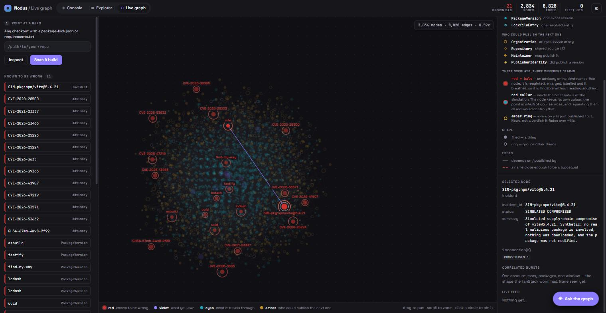

### 7.4 The blast frontier: what the attacker publishes to next

Blast radius is backward-looking: a version is compromised, which projects
already hold it. By the time that is answered, the damage is done.

The TanStack-class worm did not spread by being depended upon. It spread by
**publishing**: credentials taken from a CI pipeline, 84 artifacts across 42
packages in six minutes. Every one of those packages was predictable the moment
the first was known, because publish rights are a graph the registry hands out
for free:

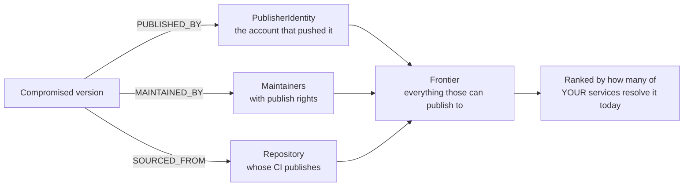

Three one-hop HydraDB queries over edges the ingest already writes, and the
ranking reuses the same `RESOLVED_IN` closure the blast radius uses, read
forwards. The output is a rotation list: these are the credentials to revoke.

### 7.5 Publish-time anomalies

The registry metadata already fetched for every version carries
`has_install_script`, `published_at`, `publisher` and `repository`. Between them
those four fields describe the TanStack compromise almost exactly, and
[`blastradius/pkg/anomaly.py`](blastradius/pkg/anomaly.py) reads them back:

| Signal | What it saw |
|---|---|
| `PUBLISHER_NOT_MAINTAINER` | Pushed by an account that is not a listed maintainer |
| `INSTALL_SCRIPT_ADDED` | An install script appeared on a package that never had one |
| `DORMANCY_BREAK` | A long-quiet package published suddenly |
| `PUBLISH_BURST` | Releases far tighter than the package's own history |
| `REPOSITORY_CHANGED` / `REPOSITORY_REMOVED` | Source repository moved or vanished |
| `CORRELATED_BURST` | One account bursting across many packages at once |

The last one is the signal no per-package check can see, and it is what separates
a worm from a maintainer having a busy afternoon.

**Unknown is not "no".** This is the rule the module is built around. The
abbreviated npm packument carries no maintainers and no publish times, and a
missing `published_at` is stored as the sentinel 0, not 1970. Treating either as
a negative would emit "published by an unknown account" for every package whose
metadata simply was not fetched. Each check states its own preconditions and
declines to fire when they are not met, and every signal is labelled INVESTIGATE
rather than presented as a verdict.

### 7.6 Typosquat neighbourhoods

HydraDB has no string functions, so this cannot run as a query. It is a
precompute that writes `TYPOSQUAT_OF` edges into HydraDB at ingest, and the query
side simply follows them.

Two things decide whether it is useful or noise. Candidate generation uses a
deletion-variant index, so the expensive edit-distance function runs on a handful
of pairs rather than millions. And a popularity guard decides correctness:
`lodash.merge`, `lodash.debounce` and `@types/lodash` all sit within a trivial
edit distance of `lodash` and none is a squat, so an edge is written only when
the target is materially more depended-upon than the candidate.

### 7.7 The live watcher

Everything above answers a question you already knew to ask. npm replicates its
registry as a public CouchDB change feed, so a watcher can see publishes as they
happen rather than waiting for an advisory that arrives hours later.

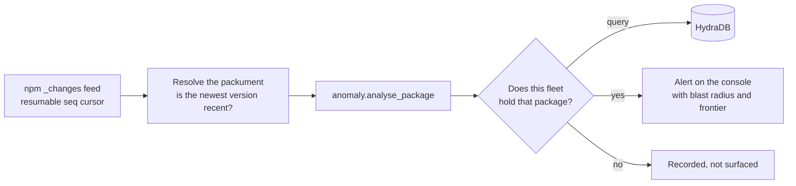

Measured at roughly 0.85 changes per second for the whole registry, which is a
trivial volume and the reason this can be a poll loop rather than a pipeline. The
watcher itself is deliberately ignorant of the graph so it can be tested without
one; deciding what a fleet hit *means* happens in `ui/live.py`, which has HydraDB.

### 7.8 Incident simulation

Nothing here touches a real malicious package. An incident is a node in our own
HydraDB graph pointing at one ordinary, healthy public package version. No
artifact is downloaded, nothing is executed, and the package is not modified. We
are testing graph logic, and graph logic does not care whether the tampering was
real.

The incident carries a **live window**, because a compromised version is usually
pulled within hours, so "did this project resolve it while it was live" is a
different and much smaller question than "does this project hold it now".
`simulate` creates one and answers every question the engine can ask about it;
`retract` removes it and leaves the graph as it was.

### 7.9 The web surface

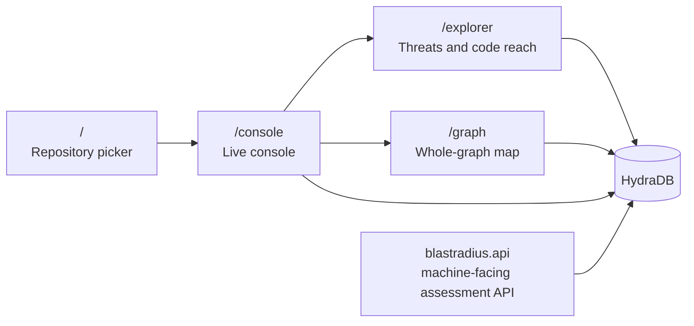

`ui/server.py` is the human-facing explorer and `blastradius/api/main.py` is the
machine-facing assessment API a CI job would call. They are deliberately separate
so the demo surface can be restarted or re-skinned without touching what other
tools depend on, and both read HydraDB directly rather than proxying each other,
which is one fewer moving part to fail during a demo.

---

## 8. The assistant

A chat interface over the same graph, in the bottom right of every page. It
exists because the queries above are precise and the questions people ask under
pressure are not: *who published the malicious package*, *what do I patch
first*, *can this actually run*.

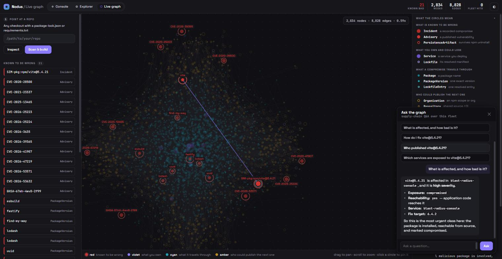

Every line of that answer came from a HydraDB query. The exposure, the
reachability, the service name and the fix target are four separate tool calls
against the graph, not the model recalling something about `vite`.

**One chatbot per repository.** Each workspace records exactly which `Service`
nodes its ingest created, and every tool the agent can call is filtered to those
ids at construction time. A chatbot for repository 2 has no callable path to
repository 1's data. The isolation is a closure, not a parameter the model fills
in, because a model that passes the wrong id would then be a data leak
rather than a wrong answer.

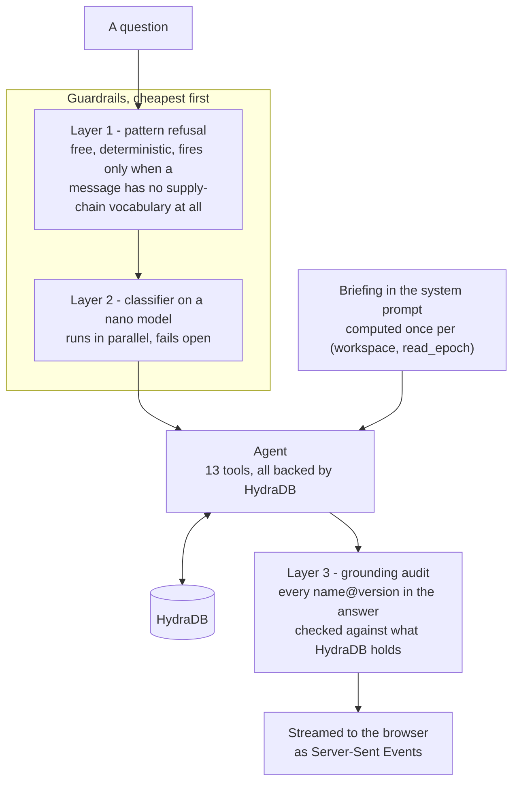

**The briefing is the speed decision.** Most of what anyone asks (what is
affected, how bad it is, what to patch first, which services) is answerable from
a few hundred facts that change only when the graph does. Making the model fetch
them turns every such question into at least two sequential model calls before
the first token can arrive. They are computed once per `(workspace, read_epoch)`
and put in the system prompt instead, so those questions cost one model call and
begin streaming immediately. Only genuine drill-downs spend a tool round trip.

**Layer 3 is the anti-hallucination half, and it is code, not a prompt rule.**
Every `name@version` the answer names is checked against the set HydraDB can
legitimately support: versions the lockfiles resolved, versions advisories name
as affected, fixed versions a remediation should recommend, and releases the
publish-history tool reported. An invented `left-pad@1.0.0` in a vulnerability
report is the failure worth catching by code, because the reader has no way to
catch it themselves.

**Provenance answers are worded carefully on purpose.** A version with no
publisher edge in HydraDB reads as *not recorded*, never as *published
anonymously*, and names nobody. A publisher outside the maintainer list is
reported as a lead with the word INVESTIGATE and without the word attacker,
because that gap is equally the signature of a stolen token, a bot, an OIDC
pipeline, and a maintainer who left last year.

The 13 tools available to it: `resolve_package`, `list_threats`, `threat_detail`,
`impacted_services`, `code_reach`, `dependency_path`, `remediation_plan`,
`attack_frontier`, `package_provenance`, `publish_anomalies`, `service_profile`,
`search_advisories`, `fleet_overview`. Every one of them is a HydraDB query.

---

## 9. Designing around HydraDB's constraints

HydraDB is a graph engine with a deliberately narrow query surface, and most of
the interesting design decisions in this project are consequences of that. These
were found by being rejected at runtime, and are written down here because they
are not obvious from the outside.

| Constraint | Consequence in this design |
|---|---|
| A variable-length traversal must pin its **source** and declare a maximum depth | Backward reachability is not expressible, so ingest writes **materialised inverse edges** and every "who reaches this" question is a forward walk |
| A bounded walk would under-report a deep npm tree | `PRESENT_IN` and `RESOLVED_IN` are **flattened closures**, computed in Python at ingest, so they are exact at any depth and cost one hop |
| `UNWIND ... MATCH ... MERGE` (write) requires exactly one label per endpoint | Edges are batched per `(type, source label, destination label)`, since `REQUIRED_BY` spans two label pairs |
| `UNWIND ... MATCH ... RETURN` (read) **forbids** labels and accepts exactly two unsorted projections | Reads never use `UNWIND`; one plain `MATCH` per id with a scalar `$id`, where labels and full projections both work |
| A list parameter is accepted only as `UNWIND` input | `algo.MSpaths` cannot take `sourceValues` as a parameter; the list is inlined as an escaped literal |
| Admission control caps query runtime (30 s stock) and rejects a label scan above 250,000 candidates | The client declares 25 s; **every read on the hot path is id-pinned**, which is why the local id map exists |
| No `IN`, `CONTAINS`, `ENDS WITH` or `IS NULL` in `WHERE` | Absence cannot be tested for, so every property is always written using explicit sentinels |
| No string functions | Semver matching, PEP 440 comparison and typosquat distance all run in Python and feed **exact ids** to HydraDB |
| Relationships are reified with their own global id | A persisted id allocator is mandatory, not optional |
| No transactions, one statement per request | Writes are `UNWIND`-batched auto-commits, and `MERGE` by id makes every re-ingest idempotent |

Two of these are worth stating as design rules rather than as trivia.

**Every edge that a query needs to walk backwards is written twice.** Measured
against a live node rather than assumed: a *single-hop* backward pattern is
actually fine, so only the relationship a query walks backwards for more than one
hop needs its inverse materialised. Applying the blanket rule everywhere would
have roughly doubled the edge count and the write time for no query gained.

**The write/read asymmetry on `UNWIND` is the one that will bite an editor.**
Writes are label-qualified, reads are not. Do not make them match, because HydraDB
rejects whichever one you change.

---

## 10. Measured results

Everything below was measured against a live HydraDB node, not estimated.

### Query latency

Corpus: 12 projects, 649 lockfile entries, 400 packages, 1,319 versions,
3,277 nodes, 18,224 edges. Warm p50.

| Query | Latency | Rows |
|---|---:|---:|
| Purl to id, local id map | 0.01 ms | 1 |
| Exact version lookup | 2.2 ms | 1 |
| Direct dependents | 10.5 ms | 25 |
| Transitive dependents (depth 5) | 94 ms | 174 |
| **Exposed projects, one hop over the closure** | **3.0 ms** | 1 |
| Shared maintainer | 8.2 ms | 1 |
| Live-window overlap | 14.7 ms | 1 |

A full `simulate` run, answering every question the engine can ask about an
incident: **310 ms**.

### Does the cost track the answer, or the graph?

The central performance claim is that the exposure query costs what the *answer*
costs, not what the graph costs. `blastradius/pkg/scale.py` measures it by
building synthetic graphs through the real writer and timing the real query
through HydraDB, asserting at every point that the query returned exactly the
services attached to its probe, so a fast wrong answer cannot pass.

Two sweeps, because a flat line on its own is unfalsifiable: it looks identical
whether the query is genuinely proportional to the answer or the harness is just
dominated by fixed HTTP overhead.

**Sweep A: the graph grows, the answer is held at 5 rows.**

| Versions in HydraDB | Closure edges | p50 | p95 |
|---:|---:|---:|---:|
| 5,000 | 5,015 | 1.02 ms | 1.37 ms |
| 50,000 | 50,015 | 1.59 ms | 1.91 ms |
| 500,000 | 500,015 | **1.95 ms** | 3.06 ms |

**Sweep B: one 500,000-version graph, the answer grows.** This is the control,
and it must rise.

| Answer rows | p50 | p95 |
|---:|---:|---:|
| 1 | 1.42 ms | 1.50 ms |
| 10 | 1.69 ms | 1.78 ms |
| 100 | 10.17 ms | 13.65 ms |
| 1,000 | 56.76 ms | 59.48 ms |

Expressed as elasticity, so the two sweeps can be compared despite moving
different units over different spans:

```
cost elasticity to graph size    0.14
cost elasticity to answer size   0.53
```

**Answer size costs 3.8 times what graph size does.** A 100x larger graph costs
1.9x; a 1000x larger answer costs 40x. The closure design holds. Reproduced
independently at 100k and at 500k with the same two figures to two decimal
places.

Graph size is not free, though, and the honest form of the claim says so: 0.14 is
above zero, so the single-hop lookup does pay something as the store grows.
"Flat" would be a stronger claim than the experiment supports.

### What the measurement changed

| Query shape against HydraDB | Median |
|---|---:|
| Pinned-id two-hop | 4.7 ms |
| Pinned-id variable-length `*1..8` | 6.3 ms |
| Label scan with a property filter | 36.6 ms |
| **Unpinned edge sweep** `(a)-[e]->(b)` | **500-770 ms** |

Traversal was never the problem. Unpinned sweeps are roughly 100 times slower
than pinned traversals and dominated everything, so both optimisations target
them: names resolve in the local id map instead of a label scan, and the views
that need a whole-graph sweep are cached against `read_epoch`. Serving the
Explorer's micro view again went from 1,198 ms to 54 ms.

### Build time

One repository (338 packages, 1 lockfile), warm registry cache, median of three
runs:

| Mode | Total |
|---|---:|
| Concurrent | **10.5 s** |
| `--sequential` | 12.6 s |

---

## 11. Running it

### Prerequisites

| Needed | Why | If missing |
|---|---|---|
| Python 3.11+ | Everything server-side | Required |
| Node 18+ | `ts-morph` runs the AST scan | Required |
| Docker | Runs the HydraDB container | Required |
| `osv-scanner` | Finds the vulnerabilities | Optional; the scan falls back to the OSV API over the resolved versions |

### Step by step

**1. Install the dependencies.**

```powershell
python -m venv .venv
.\.venv\Scripts\Activate.ps1          # cmd.exe: .\.venv\Scripts\activate.bat
pip install -r requirements.txt
cd scanner; npm install; cd ..        # ts-morph, once
```

If `Activate.ps1` is blocked by execution policy, either use the `.bat` above or
run `Set-ExecutionPolicy -Scope CurrentUser RemoteSigned` once. Nothing else in
this project needs it.

**2. Check the machine before building anything.**

```powershell
python -m blastradius.cli doctor
```

This checks every prerequisite and names the fix for each one it cannot find,
rather than failing halfway through an ingest.

**3. Start HydraDB.**

```powershell
python -m blastradius.cli up
```

Starts the container and waits until it answers. `down` stops it and keeps the
data; `status` reports the daemon, the container, readiness and contents.

**4. Build the graph from a repository.**

```powershell
python -m blastradius.cli pipeline --reset
```

Scans the repository, writes the advisories it finds, ingests both graph tiers
and prints where the time went. It defaults to `corpus/` and takes any other
checkout as an argument. Expect roughly 10 seconds on a warm registry cache.

**5. Confirm both tiers landed.**

```powershell
python -m blastradius.cli stats
```

Every label should be non-zero. If `PackageVersion` is populated but `Function`
is not, the AST scan did not run; `doctor` will say why.

**6. Start the UI.**

```powershell
python -m blastradius.cli ui          # port 8100
```

Open <http://127.0.0.1:8100>, choose the repository, and work from there. The
live graph is at `/graph`, the threat-and-reachability explorer at `/explorer`,
and the assistant is the button in the bottom right of both.

**7. Optional: see it react to an incident.**

```powershell
python -m blastradius.pkg.cli simulate     # marks a version compromised, answers everything
python -m blastradius.pkg.cli retract      # puts it back
```

The assistant needs an `OPENAI_API_KEY` in `.env`; everything else above works
without one.

### Configuration

Copy `.env.example` to `.env`:

| Variable | Purpose |
|---|---|
| `HYDRA_HTTP` | HydraDB HTTP endpoint, default `http://127.0.0.1:8443` |
| `HYDRA_TOKEN` | HydraDB bearer token |
| `HYDRA_NAMESPACE`, `HYDRA_GRAPH` | HydraDB namespace and graph |
| `HYDRA_BATCH_SIZE` | Rows per write batch. Lower it to 100 on an S3-backed node |
| `OPENAI_API_KEY` | Required only for the assistant |
| `CHAT_MODEL`, `CHAT_REASONING_EFFORT`, `CHAT_MAX_TURNS` | Assistant tuning |

A private registry needs three more, picked up by every entry point so none of
them grows its own flag: `BLASTRADIUS_REGISTRY`, `BLASTRADIUS_REGISTRY_TOKEN` and
`BLASTRADIUS_CHANGES_URL`. The token is sent only to the configured registry. A
credential for an internal registry must not travel to npmjs.org because a
package happened to resolve there, and a test asserts both directions.

### Deployed

`docker-compose.yml` runs HydraDB against an S3 bucket, the application, and
Caddy for TLS. On that deployment, seed the graph out of band rather than
ingesting through the UI:

```bash
docker compose exec blastradius-api python -m blastradius.seed
```

### Useful commands

```powershell
python -m blastradius.cli check lodash@4.17.20      # assess one version
python -m blastradius.cli stats                     # node and edge counts in HydraDB
python -m blastradius.pkg.cli simulate              # create an incident, answer everything
python -m blastradius.pkg.cli retract               # take it back off
python -m blastradius.pkg.cli frontier lodash@4.17.21
python -m blastradius.pkg.cli anomalies --offline
python -m blastradius.pkg.cli compare               # range-only leads vs lockfile truth
python -m blastradius.pkg.cli bench                 # query latency
```

---

## 12. Repository layout

```
blastradius/
  schema.py            Labels, edge types, id blocks, sentinels. One source of truth.
  ids.py               Persisted natural key to HydraDB id allocator (data/ids.sqlite)
  hydra_client.py      HydraDB HTTP client, UNWIND batching, cursor paging, Bolt fallback
  pipeline.py          One repository in, a populated HydraDB graph out
  node.py              HydraDB container lifecycle, driven from Python
  seed.py              Clone and ingest a fixed set of repositories for a hosted demo
  cli.py               doctor, up, pipeline, ingest, check, stats, ui, serve

  ingest/              The micro tier and the lockfile tier
    lockfile.py        package-lock v2/v3 parsing and npm nested resolution
    load.py            Orchestration, transitive closure, batched HydraDB writes
    bridge.py          ExternalImport to PackageVersion
    persistence.py     .claude/ and .vscode/ IOC scan
    ignore.py          .blastradiusignore scoping

  pkg/                 The ecosystem tier
    identity.py        Canonical purl keys for packages, versions, repos, people
    ingest.py          Lockfiles + registry + advisories into HydraDB
    writer.py          Batched HydraDB writes for the package tier
    blast.py           The blast-radius queries and the evidence model
    frontier.py        What the attacker can publish to next
    anomaly.py         Publish-time signals
    typosquat.py       Deletion-variant index, popularity guard, TYPOSQUAT_OF edges
    watcher.py         The npm _changes feed
    incident.py        Synthetic incidents, with a live window
    graphview.py       The macro view, answered server-side
    fullgraph.py       The whole graph as circles, cached on read_epoch
    scale.py           The complexity experiment
    semver.py          npm range matching, in Python
    pep440.py          PyPI version comparison, differential-tested
    registry.py        npm registry client with an offline cache
    osvscan.py         Repository to advisories, timed

  query/               Reads for the UI and the API
    blast.py           Q1..Q5 and the severity composition
    codereach.py       Threat to the function that runs it
    exposure.py        One heat model, shared by both views
    graphview.py       The layered code view
    advisory.py        Semver ranges to exact PackageVersion keys

  chat/                The assistant
    tools.py           Every fact it may state, read from HydraDB
    agent.py           The only module that knows OpenAI exists
    guardrails.py      Three layers: pattern, classifier, grounding audit
    briefing.py        The situation pack, cached on read_epoch
    workspaces.py      One chatbot per repository, isolated by service set
    router.py          /api/chat, streaming over Server-Sent Events

ui/
  server.py            The human-facing explorer
  live.py              Watcher, ingest jobs and simulations, on one event bus
  static/              start, console, explorer, graph, chat widget
  web/                 React rebuild of the console (Vite)

scanner/scan.mjs       ts-morph AST scanner, emits the micro graph
osv_scanner_tool/      osv-scanner and OSV API wrappers, dependency resolver
corpus/                Target repositories
advisories/            The advisory contract, as files
data/registry-cache/   Committed npm metadata, so an ingest is reproducible offline
docs/ENGINEERING.md    The full engineering write-up
PACKAGE-GRAPH.md       The ecosystem tier in depth, with the measurements
```

---

## 13. Testing

```powershell
python -m pytest tests/ -q
```

28 test modules, 449 test functions. Tests that need a live HydraDB node skip
themselves cleanly when one is not reachable.

The suite is written around the failures that would be invisible rather than
around coverage:

| Test module | What it defends |
|---|---|
| `test_oracle.py` | The graph's answer equals a deliberately stupid brute-force oracle that re-implements npm resolution independently, so an error in one is unlikely to be mirrored in the other |
| `test_identity.py` | The two ingest paths cannot drift apart on keys, the failure that once reported a clean bill of health for a repository with 96 advisories |
| `test_exposure.py` | Advisories actually reach code across the bridge |
| `test_closure.py` | The flattened closure matches a real traversal |
| `test_semver.py`, `difftest_semver.py` | Range matching, differentially tested |
| `test_pep440.py` | PyPI ordering, differentially tested against `packaging` |
| `test_anomaly.py` | Unknown is reported as unknown, never as a negative |
| `test_chat_guardrails.py` | The three layers, including that the classifier fails open |
| `test_chat_provenance.py` | A missing publisher reads as "not recorded" and names nobody |
| `test_live.py` | System directories are refused as ingest targets |
| `verify_constraints.py` | What HydraDB actually accepts, measured rather than assumed |

---

## 14. Known limits

Stated rather than papered over.

- **Route detection is Express and Fastify shaped**, and pattern-based. A route
  registered by decorator or built from a dynamic table is missed. The scanner
  reports its counts in `stats` rather than claiming to be exhaustive.
- **Dynamic dispatch cannot be resolved** by any static analyser. `obj[name]()`
  and callbacks through a registry are counted in `stats.dynamicCalls`.
- **`P2 IMPORTED` means imported by *your* source.** A transitive dependency is
  imported by an intermediate package's code, not yours, so for deep
  dependencies the reachability signal comes from the direct dependency that
  leads to it.
- **Lockfile v1 is rejected loudly** rather than parsed partially. A half-parsed
  lockfile would read as "this repository is clean", which is the worst possible
  way to be wrong.
- **Two repositories sharing a service name share one HydraDB node**, and no
  filter downstream can separate them again. This is detected at workspace
  registration and reported rather than silently accepted.
- **The change feed is npm-specific.** Artifactory, Verdaccio and Nexus each
  expose something different or nothing, so the live watcher does not simply
  fall in behind a private registry.
- **Typosquat findings have no UI.** The edges are in HydraDB and the module has
  six detection techniques, but no endpoint returns them yet.
- **Download counts are npm-only**, so a private registry loses popularity data.
  Unknown counts are treated as unknown, not as zero, so internal packages are
  reported as unassessed rather than as unpopular.

---

## Further reading

- [docs/ENGINEERING.md](docs/ENGINEERING.md): the full engineering write-up,
  setup variations, the advisory contract, the private registry path, and every
  decision in detail.
- [PACKAGE-GRAPH.md](PACKAGE-GRAPH.md): the ecosystem tier in depth, the
  evidence model, and the complete measurement record.
