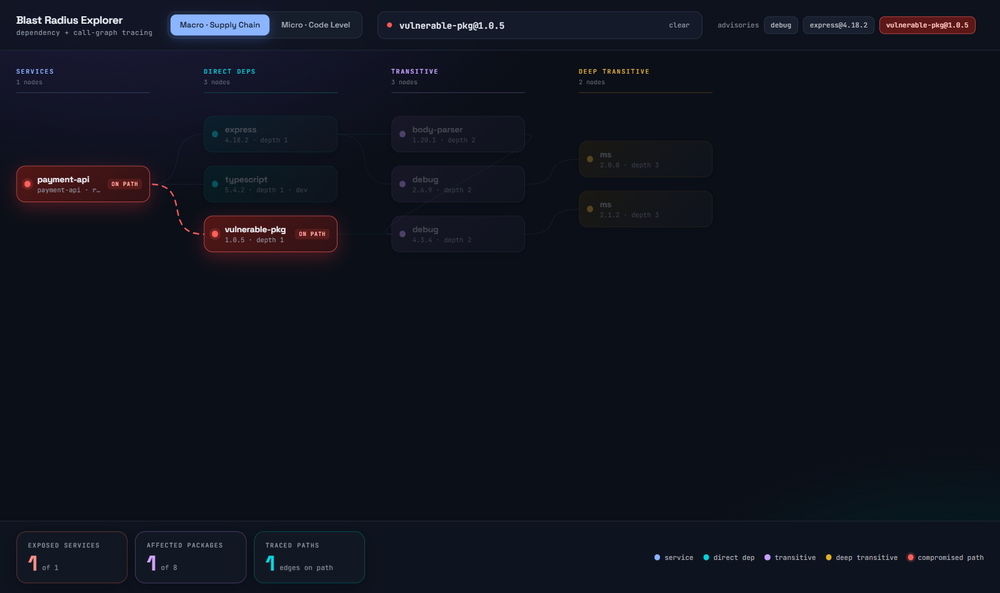
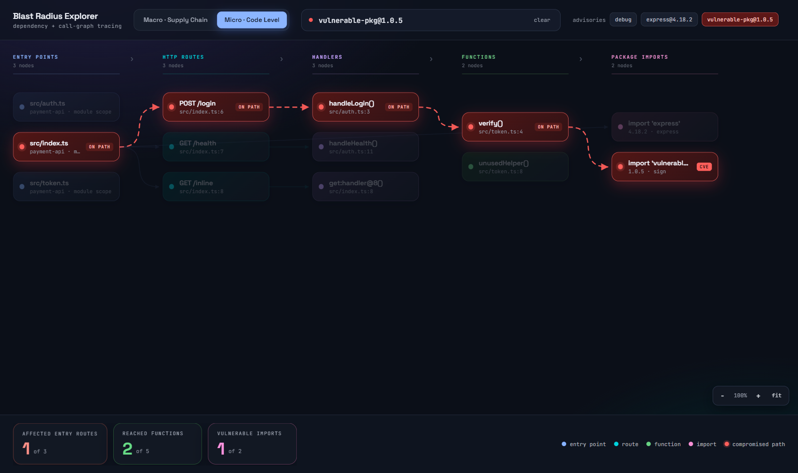
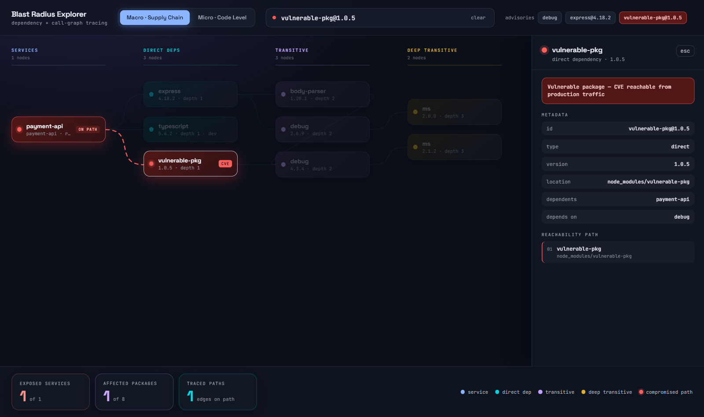
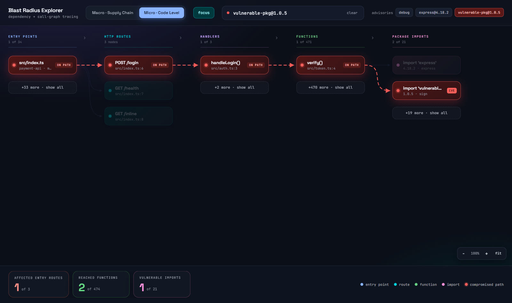
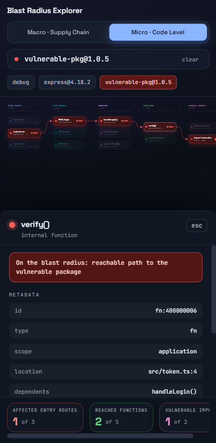
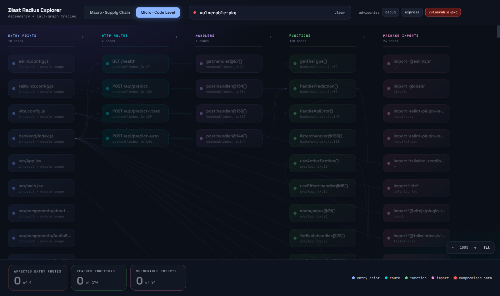

# Blast Radius

**Track 2A / problem A — supply chain blast radius.**

A package is compromised at 09:00. Which of your services are exposed by 09:06,
and does your code actually *run* the poisoned dependency?

`npm audit` answers the first half of that for one repo. This answers both
halves across a fleet, and tells you which alerts you can safely ignore.

---

## The idea in one paragraph

The problem statement frames this as a traversal over the npm ecosystem graph —
tens of millions of versioned nodes. We do not build that graph, because we do
not need it. **A `package-lock.json` v3 already is a fully-resolved dependency
graph**: every entry under `packages` names its own resolved dependencies. So
scanning a fleet of repos yields an exact dependency graph with no registry
crawl, no semver re-resolution and no approximation.

That gets you the macro graph. On its own it is still just a lockfile scanner.
The differentiator is the second graph, built with `ts-morph` over the real
TypeScript compiler API, and the bridge between them:

```
[Service: payment-api]
       |
       +--> (macro / lockfile) ----> [PackageVersion: ua-parser-js@0.7.29]
       |                                          ^
       +--> (micro / AST)                         | RESOLVES_TO
            [File: src/token.ts]                  |
               +- [Function: verify()] --CALLS_EXTERNAL--+
                     ^
                     +--CALLS-- [Function: handleLogin()]
                                      ^
                                      +--HANDLED_BY-- [Route: POST /login]
```

The macro graph says *you have it*. The micro graph says *an HTTP request can
reach it*. Those are very different incidents.

---

## Severity tiers

| Tier | Meaning |
|---|---|
| **P0 CONFIRMED** | Exposed **and** a persistence artifact is on disk. The worm wrote into `.claude/` or `.vscode/`, so `npm uninstall` does not clear it. |
| **P1 REACHABLE** | Exposed **and** an HTTP route reaches the calling function. |
| **P2 IMPORTED** | Exposed and imported from source, but no route path found. |
| **P3 INSTALLED** | In the lockfile, never imported. **Safe to deprioritise.** |

P3 is not filler. Telling a team which 30 of 40 alerts they can ignore at 09:06
is where most of the saved time in a real incident comes from, and it is the one
thing a flat lockfile scan structurally cannot do.

---

## Quick start

Everything runs through one Python entry point — no `.ps1` required, so you
never have to touch PowerShell's execution policy.

```powershell
python -m venv .venv
.\.venv\Scripts\Activate.ps1          # cmd.exe: .\.venv\Scripts\activate.bat
pip install -r requirements.txt
cd scanner; npm install; cd ..        # ts-morph, once

python -m blastradius.cli doctor      # checks every prerequisite, names the fix
python -m blastradius.cli up          # start the HydraDB container

# Scan corpus/ for real vulnerabilities and build both tiers from it.
python -m blastradius.cli pipeline --reset

python -m blastradius.cli status      # both tiers should be non-zero
python -m blastradius.cli ui          # Blast Radius Explorer, port 8100
```

`pipeline` is the whole build: it scans the repository with `osv-scanner`,
writes the advisories it found, ingests the code graph and the package tier
from that same path, and prints where the time went. It defaults to `corpus/`
and takes any other checkout as an argument. The scan, the code graph and the
registry prefetch run concurrently — see
[Where the vulnerabilities come from](#where-the-vulnerabilities-come-from).

The three steps it wraps are still there, and are what to reach for when you
want to rebuild one tier without the others:

```powershell
python -m blastradius.cli osv-scan corpus       # advisories only, no graph writes
python -m blastradius.cli ingest                # code graph + lockfile tier -> Micro
python -m blastradius.pkg.cli ingest --offline  # package tier               -> Macro
```

**Both ingests are required**, which is why `pipeline` runs them together. They
populate different halves of the graph and neither backfills the other:
`blastradius.cli ingest` builds the code graph and the lockfile tier the Micro
view walks, and `blastradius.pkg.cli ingest` builds the package tier — declared
ranges, lockfile resolutions, maintainer and repository identity — that the
Macro view queries. Run only the first and the Explorer opens on an empty Macro
tab with no targets to pick.

`--offline` reads `data/registry-cache/`, which is committed, so the ingest is
reproducible with the network off. Drop the flag to refresh from npm.

If `Activate.ps1` is blocked, either use the `.bat` above or run
`Set-ExecutionPolicy -Scope CurrentUser RemoteSigned` once. Nothing else in
this project needs it.

`hydra.ps1` still exists and does the same job, but `blastradius.node` drives
Docker from Python and is the supported path.

Then open <http://127.0.0.1:8100> and pick a target chip, or type
`name@version` and press Enter. The assessment API and its simpler UI are a
separate server — `python -m blastradius.cli serve`, port 8000 — and that is
the one with **Simulate 09:00**.

### Starting clean

Two levels, and the difference matters. Both clear the id map in `data/`, which
is the "memory" mapping a natural key like `lodash@4.17.21` to a node id. The
graph and that map have to go together: drop one without the other and the next
ingest allocates fresh ids and writes a second copy of everything beside the
first.

```powershell
python -m blastradius.cli reset       # empty the graph + id map, node comes back up
python -m blastradius.cli wipe        # destroy container, volume and id map (asks first)
```

`reset` is the everyday one, and it takes about five seconds. It drops the
store and brings the node straight back, so you end up with a running node, an
empty graph and a fresh id map. Re-run both ingests afterwards.

It works this way because deleting rows does not scale here: the node costs
roughly 319 ms per node in a batched `DETACH DELETE`, so a few thousand nodes
takes many minutes *and* trips the 25 s per-query timeout partway through,
leaving the graph half-cleared. Dropping the store is O(1) and cannot finish
halfway.

`wipe` is the same demolition without the rebuild, plus a confirmation prompt.
Reach for it when you want the node gone rather than reset — otherwise `reset`
is what you want, since `wipe` leaves you to run `up` yourself.

`data/registry-cache/` survives both on purpose: it is a build input rather than
graph state, and keeping it is what lets the rebuild run `--offline`.

A full rebuild from nothing is one command, since `pipeline --reset` does the
demolition and the rebuild in the right order:

```powershell
python -m blastradius.cli pipeline --reset
python -m blastradius.cli stats       # node and edge counts, both tiers
```

## The Explorer

`ui/` is a separate frontend server from `blastradius/api/`. That one is the
machine-facing assessment API a CI job would call; this is the human-facing
explorer. Keeping them apart means the demo surface can be restarted or
re-skinned without touching what other tools depend on, and it reads HydraDB
directly rather than proxying — one fewer moving part to fail on stage.

Three pages, each answering a different question:

| Page | Question |
|---|---|
| `/console` | Which projects resolved one exact version, and on what evidence? |
| `/explorer` | What is confirmed wrong, and can any of it be reached from our code? |
| `/graph` | What is happening on npm right now, and what would a compromise do? |

**`/explorer` — confirmed threats, and the last mile.** Section 1 lists every
advisory, incident and deprecation against a version this graph holds, grouped
by version rather than by CVE. Section 2 traces the selected one down to
source: `PackageVersion -> dependency chain -> ExternalImport -> Function ->
callers`. On this repository 2 of 13 confirmed threats reach code — `vite@5.4.21`
via two separate import paths that both land in `vite.config.js`. The other
eleven are installed and never imported, which the page says in those words:
*installed, but not reached from your source*. That is not "not affected", and
it is the difference between patch-now and patch-Tuesday.

**Macro — the supply chain.** Scoped to one exact version, and read left to
right as an argument:

    THREAT -> COMPROMISED -> RANGE ADMITS -> LOCKFILE RESOLVES -> PROJECTS

The third column is a dead end. It holds every version whose declared range
would accept the compromised one — the leads a range-only tool reports — and it
connects to nothing on its right, because admitting a version is not installing
it. Only the fourth column, the resolutions a lockfile actually recorded,
reaches a project. On the corpus in this repo that is 25 nodes against 1.

The highlight is not computed in the browser. Exposure is a fact already stored
on an edge, so guessing it client-side by matching package names would put back
exactly the range-only heuristic the model exists to replace.



> The screenshot above still shows the previous depth-column view and needs
> retaking against the current one.

**Micro — the call graph.** The claim no lockfile scanner can make:
`src/index.ts → POST /login → handleLogin() → verify() → import 'ua-parser-js'`.



Note what is *dimmed* there: `GET /health`, `unusedHelper()`, `import 'express'`.
That is the "safe to ignore" signal, and it is the half of an incident response
that actually saves time.

Edges carry arrowheads and the column gutters carry chevrons, so the direction
the graph reads is stated rather than implied. On the hot path the dashes flow
along the arrow.

Clicking any node opens metadata and the reachability path:



**Focus mode** is what makes this usable on a real application. Drawing all 474
functions produces a canvas metres tall that answers nobody's question, so by
default the view shows only the blast radius plus **one hop of context** either
side -- what else calls these, what else they reach -- so the boundary is
visible and not just a bare chain. Each column reports `1 of 471` and offers
`+470 more`, which opens that column alone.



With no query there is no blast radius to compute, so each column falls back to
its ten most-connected nodes: the hubs are what is worth seeing first. Toggling
`focus` off draws everything, which is occasionally what you want and never
what you want first.

It is responsive down to phone width: the graph auto-fits (shrink only — a
four-node graph blown up to fill a monitor implies more than is there), the
detail drawer becomes a bottom sheet, chips and metrics scroll sideways, and
the legend drops since the column headers already carry the colours. A
zoom/fit control sits bottom-right; touching it hands you manual control and
stops the auto-fit from fighting you on resize.



### The redesigned console (`/console`)

A React rebuild of this same Explorer lives in `ui/web` (Vite + React 18).
`npm run build` there compiles into `ui/static/app`, which `server.py` already
mounts; the build output is gitignored on purpose (see `.gitignore`) so a
stale bundle can never silently outrank the source it was built from. Until
that build has been run once in a given checkout, `GET /console` falls back
to the standalone `ui/static/console.html` rather than 404ing.

Two gaps worth knowing about before demoing off this branch:

- **`/api/repos` has no backend yet.** `ui/web/src/lib/api.js` already says so
  in a comment — the Repos view degrades to `localStorage` and states that
  rather than faking a queue.
- **`scale` is CLI-only**, and deliberately: it is a measurement harness, not a
  view, and its destructive mode is gated behind
  `BLASTRADIUS_DESTRUCTIVE_TESTS=1`. `frontier` and `anomalies` are no longer
  CLI-only — the watcher runs the anomaly checks on every live publish and the
  frontier on every fleet hit — but the UI shows only their *counts*. The
  routes, per-target evidence atoms and confidence tiers that
  `python -m blastradius.pkg.cli frontier` prints still have no view.
- **`compare` has no view either.** Range-only-vs-lockfile-truth is the central
  accuracy claim and it is reachable only from the CLI; the simulation computes
  the number and does not render it.
- **Typosquats are invisible in every UI.** `TYPOSQUAT_OF` edges ship in the
  `/api/graph/full` payload but are drawn in the same grey as every other edge,
  and no endpoint returns typosquat findings. The module has six detection
  techniques and no surface.

### Making it fast

Measured rather than guessed, and the answer was not where it looked:

| Query shape | Median |
|---|---|
| Pinned-id 2-hop | 4.7 ms |
| Pinned-id variable-length `*1..8` | 6.3 ms |
| Label scan + property filter | 36.6 ms |
| **Unpinned edge sweep** `(a)-[e]->(b)` | **500-770 ms** |

Traversal was never the problem. Unpinned sweeps are ~100x slower than pinned
traversals and dominated everything, so both fixes target those:

- **Names resolve locally.** `held_versions` was a label scan, because there is
  no index behind `p.name`. `data/ids.sqlite` already maps the canonical purl
  (`pkg:npm/lodash@4.17.21`) `-> id` and SQLite indexes it -- 0.02 ms instead of 36 ms. Candidates are then
  confirmed against the graph in a single `UNION ALL` of pinned lookups, since
  the id map outlives the graph and would otherwise name versions that are no
  longer there.
- **The Explorer caches the micro view against the node's `read_epoch`**, which
  advances only when writes land. Building it costs six unpinned sweeps;
  serving it again costs one pinned lookup — **1198 ms -> 54 ms** — and an
  ingest invalidates it automatically. The macro view is not cached this way:
  it is answered per target rather than swept whole, and reports its own
  measured cost in the footer.

The micro graph is sent to the browser once and its blast radius is a reverse
BFS in JS, so typing in the search box costs no round trips. That works because
the code graph is small and the question there really is "what reaches this".

The macro view is the case where it does not work, which is why it moved server
side: over the package tier a client-side name match cannot tell a version a
range merely admits from one a lockfile resolved. It runs on the same
`RESOLVED_IN` and `SATISFIES` edges the CLI uses, and commits on Enter rather
than filtering per keystroke — one blast-radius analysis per character typed is
not a search box.

The design came from a Claude Design project and is implemented here in vanilla
JS — the source `.dc.html` targets a React template runtime we do not ship.

### Scanning any Node app (micro graph only)

The macro graph needs a resolved lockfile. The call graph needs only source, so
it has its own entry point that skips the lockfile and the bridge entirely:

```powershell
python -m blastradius.cli reset                    # clear graph + id map together
python -m blastradius.cli scan ..\some-node-app
python -m blastradius.cli ui
```



**Paths.** The argument is an ordinary relative or absolute directory path,
resolved against your current working directory. In **Git Bash** use forward
slashes: a backslash is an escape character there, so `..\GenReal.ai` silently
becomes `..GenReal.ai` before Python ever sees it. Backslashes are fine in
PowerShell and cmd. If a path does not resolve, the error prints what it
resolved to, your working directory, and any nearby directory that looks like
what you meant.

**Service name** comes from `package.json`'s `name`, falling back to the folder
name. Many templates ship with `"name": "project"`, so pass `--service` when you
want something meaningful in the graph.

Without the bridge an import carries no resolved version, so searching by
package name still highlights but "which version" stays a macro-graph question.

**Clearing state:** see [Starting clean](#starting-clean) above. `reset` drops
the store *and* deletes `data/ids.sqlite`. Those must go together. Dropping the
store alone is harmless (ids just continue from a higher counter), but deleting
`ids.sqlite` while the graph still holds data gives every node a fresh id and
duplicates the lot.

### Or from the terminal

```powershell
python -m blastradius.cli stats                            # what is in the graph
python -m blastradius.cli services                         # ingested services
python -m blastradius.cli check ua-parser-js@0.7.29        # one package
python -m blastradius.cli check express --range ">=4.18.0 <4.19.0"
python -m blastradius.cli advisory advisories\GHSA-ua-parser-js-2021.json
```

`check` prints the macro answer, the micro answer, and the verdict in one pass,
and exits non-zero when anything lands in P0 or P1 — so it doubles as a CI gate.

The package tier has its own terminal surface, and it is the quickest way to
see what the Macro view is drawing:

```powershell
python -m blastradius.pkg.cli compare lodash@4.17.21     # range-only leads vs lockfile truth
python -m blastradius.pkg.cli simulate lodash@4.17.21    # mark it compromised, print the report
python -m blastradius.pkg.cli retract lodash@4.17.21     # take the mark back off
python -m blastradius.pkg.cli bench lodash@4.17.21       # query latency
python -m blastradius.pkg.cli frontier pino@10.2.1       # where the worm goes NEXT
python -m blastradius.pkg.cli anomalies --offline        # publish-time signals
python -m blastradius.pkg.cli scale --yes                # the scale experiment (destructive)
```

`frontier` is the forward-looking half, and the one no scanner answers: given a
compromise, which packages can the implicated credentials publish to *next*,
ranked by how many of your services resolve each one today. See
[PACKAGE-GRAPH.md §10b](PACKAGE-GRAPH.md). `anomalies` reads publish metadata
for the worm's own signature — bursts, install scripts appearing, publishes from
outside the maintainer list.

`compare` is the one that states the case without any UI: it prints how many
versions a declared range admits against how many a lockfile actually resolved.
`simulate` writes an `Incident` node in our own database pointing at an
ordinary, healthy public package — nothing is downloaded, nothing is executed,
and no package is modified. The edge lands on the `PackageVersion`, never the
`Package`, which is why marking `4.17.21` leaves `4.17.20` untouched.

Run everything Docker-related from **PowerShell, never Git Bash**. Git Bash
rewrites container-side absolute paths — `/data/store` arrives as
`C:/Program Files/Git/data/store` — and the node dies with a bare
`PermissionDenied` that names no path.

---

## Ask it questions (`/chat`)

`osv-scanner` tells you what is wrong. The Explorer shows you where it reaches.
Neither answers the question somebody actually asks at 09:06, which is *"what
do I do about it"* -- so there is a chat agent over the same graph, at
<http://127.0.0.1:8000/chat>.

```powershell
# 1. Ingest a repository, as normal.
python -m blastradius.cli pipeline corpus --reset

# 2. Give it a chatbot.
python -m blastradius.chat.cli add corpus/fleet --label "Corpus fleet"

# 3. Ask, from the terminal or the browser.
python -m blastradius.chat.cli ask 1 "what is vulnerable, and what do I fix first?"
python -m blastradius.chat.cli repl 1
```

It needs one key. Copy `.env.example` to `.env` and set `OPENAI_API_KEY`;
nothing else in that file has to change. `.env` is gitignored, and this is
also the first thing in the project that actually *loads* it -- the `HYDRA_*`
variables `.env.example` has always documented were previously expected to be
exported by hand, and now are not.

### One chatbot per repository

`/chat/1` and `/chat/2` are different chatbots over different repositories,
and they do not share findings. Asking #2 about a package only #1 has gets
*"not resolved by any service in this repository"*, not a borrowed answer.

That guarantee cannot come from the store. HydraDB scopes by graph and by
namespace, but the token this project ships is authorised for `default` alone
-- anything else is a 403 -- so a graph per repository would mean
re-provisioning auth. It comes instead from **ownership of a service set**: a
workspace records exactly which `Service` nodes an ingest wrote, and every
tool the agent can call is filtered to those ids. Two repositories then sit in
one graph, sharing the `PackageVersion` nodes they genuinely have in common,
and stay answerable apart.

The one hazard is a name collision. `service_key` is `svc:<name>`, so two
repositories that both contain a service called `api` collapse onto one node
and no filter downstream can separate them again. That is detected at
registration and reported, because silently merging two teams' exposure is the
failure this design exists to prevent.

```powershell
python -m blastradius.chat.cli list          # every chatbot and what it owns
python -m blastradius.chat.cli brief 1       # the situation pack, verbatim
python -m blastradius.chat.cli refresh 1     # re-resolve ids after a `reset`
```

`refresh` matters after `reset`: that clears `data/ids.sqlite` and the next
ingest renumbers every node, so a workspace still holding the old ids would
match nothing at all -- which reads exactly like a clean bill of health.

### Why it answers in a second and not five

Most of what anyone asks -- *what is affected*, *how bad*, *what first*,
*which services* -- is answerable from a few hundred facts that change only
when the graph does. Making the model fetch them turns every such question
into two sequential model calls plus a graph read, and no token can arrive
until all of it finishes.

So they are computed once per `(workspace, read_epoch)` and put in the prompt
instead, as a ~350-token table. Those questions then cost **one** model call
and start streaming immediately; only real drill-downs spend a tool round
trip. The pack is a stable prefix, so OpenAI's prompt caching hits it on every
follow-up.

| | first token | tools |
|---|---:|---|
| "what is vulnerable?" | ~0.9-1.7 s | none -- answered from the pack |
| "how do I fix `uuid@8.3.2`?" | ~2.6-3.8 s | `remediation_plan` |

Cold, the pack costs a whole-graph index build plus a sweep per service
(~2.4 s on the twelve-service corpus); warm it is ~16 ms. The page calls
`POST /api/chat/{ref}/warm` on load so that lands while somebody is still
reading the screen. Tracing is disabled, reasoning effort is `low`, and
`CHAT_MAX_TURNS` caps the tool loop so a bad question fails fast.

Mini-class models only, and it is checked rather than assumed -- `CHAT_MODEL`
defaults to `gpt-5.4-mini` and a full-size model is refused with a 503.

### What it will not do

The facts come from `blastradius/chat/tools.py`, which is plain Python over
HydraDB with no OpenAI import and no key -- so it is unit-tested against a
real graph, and the model only chooses between answers and phrases them.
Three rules are load-bearing:

- **"Not scanned" is never "not affected".** With no code graph the reach
  column reads `?`, the prompt says `UNKNOWN, not clear`, and
  `remediation_plan` refuses to deprioritise on reachability. Empty
  reachability data looks exactly like an all-clear, and reporting it as one
  tells somebody to ignore a live vulnerability.
- **"Installed but not reached" is not "not affected" either.** It means
  deprioritise, not dismiss -- the package is still on disk.
- **Never the lowest published fix.** OSV lists a fixed version per affected
  *branch*, so one advisory on `vite@5.4.21` reports `0.1.24`, `2.14.1`,
  `6.4.3`, `7.3.5` and `8.0.16` together. Taking the lowest recommends a
  five-major **downgrade** onto a branch that was never patched, so
  `recommended_fix` filters to versions above what is installed first, and
  returns nothing when the branch in use has no forward fix.

Remediation is assembled from facts rather than advice: a direct dependency
gets `npm install`, a transitive one gets an `overrides` block, because an
install silently will not move it.

```
tests/test_chat_tools.py       the facts, and the downgrade bug, without a key
tests/test_chat_workspaces.py  isolation and collision detection
tests/test_chat_briefing.py    token budget, and that the caveat survives
tests/test_chat_router.py      routing and every failure message
tests/test_chat_agent_live.py  the model in the loop; skipped with no key
```

---

## The graph model

**Macro (lockfile).** The ingest tier, unchanged. The ecosystem tier the macro
*view* reads — `SATISFIES`, `RESOLVED_IN`, maintainer and repository identity,
and the evidence atoms a finding is built from — is documented separately in
[PACKAGE-GRAPH.md](PACKAGE-GRAPH.md).

| Edge | From → To |
|---|---|
| `DEPENDS_ON` | Service → PackageVersion, PackageVersion → PackageVersion |
| `REQUIRED_BY` | materialised inverse |
| `PRESENT_IN` | PackageVersion → Service — the flattened transitive closure |
| `HAS_PACKAGE` | materialised inverse |

**Micro (ts-morph AST)**

| Edge | From → To |
|---|---|
| `CONTAINS` | File → Function |
| `CALLS` / `CALLED_BY` | Function → Function, and its inverse |
| `CALLS_EXTERNAL` / `IMPORT_USED_BY` | Function → ExternalImport, and its inverse |
| `HANDLED_BY` / `HANDLES` | Route → Function, and its inverse |

**Bridge**

| Edge | From → To |
|---|---|
| `RESOLVES_TO` / `IMPORTED_AS` | ExternalImport → PackageVersion, and its inverse |

`ExternalImport` is keyed per **(service, specifier)**, not globally, because two
services can resolve `lodash` to different versions — and that difference is
exactly what the tool exists to surface.

### One key per thing, across both tiers

Both ingest paths write `PackageVersion` and `Service` nodes, and ids are
allocated per `(label, natural_key)`. So the *key function* is a correctness
boundary, not a formatting choice: `blastradius/ingest/` and `blastradius/pkg/`
both go through `pkg/identity.py` (`version_key`, `package_key`, `service_key`),
and neither may build a key inline.

They once disagreed — `vite@6.3.6` from the lockfile loader against
`pkg:npm/vite@6.3.6` from the package tier — and the result was two
unconnected nodes for every package version in the repo. Advisories attached to
one copy; the dependency tree and the `RESOLVES_TO` bridge attached to the
other. Nothing errored, no count looked wrong, and

```
MATCH (:Advisory)-[:AFFECTS]->(v:PackageVersion)<-[:RESOLVES_TO]-(:ExternalImport)
```

returned zero rows, so the product reported a clean bill of health for a repo
with 96 published advisories in it. `tests/test_identity.py` and
`tests/test_exposure.py` hold the guards.

### Exposure is one model, read by both views

`blastradius/query/exposure.py` walks the package tree, the bridge and the code
graph as a **single** edge set, backwards from every version an advisory names,
and grades each node it reaches:

```
heat = severity_base - hops * DECAY
```

Both `/api/pkg/project` and `/api/graph?mode=micro` read that one model, so the
two tabs cannot disagree about the same CVE. It is walked as one set rather than
two because a module rarely imports the vulnerable package itself — this repo
imports `react-router-dom`, which is clean, while the thirteen advisories sit on
`react-router` one hop below it. Two separate walks stop at the bridge and call
that file safe.

The UI draws `heat` directly: green where nothing reaches a node, then yellow,
orange and red as it climbs. Severity decides where a node starts on the ramp
and distance walks it down, so a critical two hops out still outranks a low one
at the source.

---

## Two decisions that are not obvious

### Every edge is written twice

HydraDB requires a variable-length traversal to **pin the source id**; `*` and
`*1..` are rejected and patterns are directed with exactly one type. A backward
walk is therefore not expressible at all. Every "who reaches this" question is a
forward walk over a materialised inverse edge, written at ingest. See
`INVERSE_OF` in `blastradius/schema.py` — it is the reason ingest writes each
edge in both directions, not an optimisation.

### `PRESENT_IN` is a flattened closure, not a traversal

A variable-length walk must declare a maximum depth. Real npm trees are
routinely deeper than any bound worth hardcoding, so answering "is this package
in that service" with `[:REQUIRED_BY*1..8]` would **silently under-report** deep
exposure — the failure mode that most flatters the tool. The closure is computed
in Python at ingest instead, which makes the query exact at any depth *and*
turns it into a single hop. Call-graph walks still use a bound (`MAX_CALL_DEPTH`,
8) because call chains genuinely are short; the bound is returned in the API
response so nobody mistakes a truncated answer for a complete one.

---

## HydraDB constraints worth knowing before you edit a query

These were all found the hard way, by being rejected at runtime. They are not
in `cypher-compat.md`, so they are written down here.

| Constraint | Consequence |
|---|---|
| Variable-length needs a pinned source and an upper bound | materialised inverse edges; flattened closure |
| **`UNWIND … MATCH … MERGE` (write) requires exactly one label per endpoint** | edges are batched per `(type, src label, dst label)`, since `REQUIRED_BY` spans two label pairs |
| **`UNWIND … MATCH … RETURN` (read) forbids labels**, demands the first projection be the source field, and accepts exactly two unsorted projections | reads never use `UNWIND` — they issue one plain `MATCH` per id with a scalar `$id`, where labels and full projections both work |
| **A list parameter is accepted only as `UNWIND` input** | `algo.MSpaths` cannot take `sourceValues` as `$param`; the list is inlined as a literal (escaped in `_literal_list`) |
| **Admission control caps `client_query_runtime_ms`** (30 s stock) | asking for more is an HTTP 429; the client defaults to 25 s |
| No `IN`, `CONTAINS`, `ENDS WITH`, `IS NULL` in `WHERE` | every property is always written, using sentinels |
| No string functions | semver matching happens in Python, which feeds exact ids to the graph |
| Relationships are reified with their own global `id` | a persisted id allocator is mandatory — `blastradius/ids.py` |
| `sum`/`avg` unsigned ints only | timestamps are epoch-second integers |
| No transactions, one statement per request | writes are `UNWIND`-batched auto-commits; `MERGE` by id makes re-runs idempotent |

The write/read asymmetry on `UNWIND` is the one that will bite an editor:
**writes are label-qualified, reads are not.** Do not make them match — the
server rejects whichever one you change.

Base list: `../hydradb/cypher-compat.md`.

---

## Where the vulnerabilities come from

They are scanned, not written down. `osv_scanner_tool/` drives Google's
`osv-scanner` over a repository, and `blastradius/pkg/osvscan.py` turns what it
finds into the two inputs the graph already consumes:

| Output | Consumer | What it makes dynamic |
|---|---|---|
| `data/osv/<repo>/osv_scan_results.csv` | `blastradius/pkg/osv.py` → package tier | `Advisory` nodes and `AFFECTS` edges — the Macro view's threat column |
| `advisories/generated/*.json` | `blastradius/query/advisory.py` → micro tier | `cli advisory`, `cli check` and the one-click chips in both UIs |

Writing both is the point: they feed different tiers, and a scan that populated
only one would leave half the tool still hardcoded. The hand-written samples in
`advisories/` stay where they are — generated files live in the `generated/`
subdirectory and are cleared and rewritten on every scan, so the two never
fight.

```powershell
# Scan only: writes the CSV, the advisory JSON, and a timed log report.
python -m blastradius.cli osv-scan corpus

# Scan and rebuild both tiers, end to end. Defaults to corpus/.
python -m blastradius.cli pipeline --reset
```

`pipeline` is the one to reach for. The three commands it replaces —
`osv-scan`, `cli ingest`, `pkg.cli ingest` — all have to agree on *which*
repository they are talking about, and running them against different paths
gives you a graph whose vulnerabilities describe somebody else's code. It also
times every stage and writes `pipeline-log.md` beside the CSV, which is the
only place the end-to-end cost is measured rather than estimated.

### What runs beside what

Three of the four stages do not depend on each other, so `blastradius/pipeline.py`
runs them together:

```
+-- phase A (concurrent) ------------------------------------------+
|  osv scan          -> files only, touches neither graph nor ids  |
|  code graph ingest -> the only graph writer in this phase        |
|  registry prefetch -> warms data/registry-cache/, network only   |
+------------------------------------------------------------------+
                                |
phase B: package tier ingest  <-+  needs the scan's CSV, the ids the
                                   code graph allocated, and the registry
                                   documents now sitting in cache
```

The split is drawn along what each stage **writes**, not along what would be
convenient. Exactly one member of phase A writes to the graph and exactly one
writes `data/ids.sqlite`, so there is no lock to contend and no ordering to get
wrong. The package tier is not in there because it genuinely depends on all
three — starting it early would mean ingesting advisories the scan had not
finished finding.

The prefetch is the one that pays. The package tier spends most of its time
waiting on the npm registry, and those documents are keyed by package name —
which the lockfiles already name, before any advisory is known. On a cold cache
that stage alone was ~11 s of a 19 s run.

`--sequential` turns the overlap off. When a stage fails, being able to run the
same work in a straight line is worth more than the seconds.

### Measured

One repo (`corpus/drawio-desktop`, 338 packages, 1 lockfile), warm registry
cache, three runs each, median:

| Mode | Total |
|---|---:|
| concurrent | **10.5 s** |
| `--sequential` | 12.6 s |

Where the concurrent run spends it:

| Stage | Seconds | Share |
|---|---:|---:|
| reset (drop store, clear id map, restart) | 2.87 | 26.7% |
| **phase A** | **3.29** | **30.7%** |
| ├ registry prefetch | 1.68 | ∥ |
| ├ osv scan (1 lockfile → 5 findings → 3 advisories) | 3.13 | ∥ |
| └ code graph ingest (ts-morph) | 3.29 | ∥ |
| package tier ingest | 4.29 | 39.9% |
| verify | 0.29 | 2.7% |

The `∥` rows overlap, so they are given a marker rather than a share — three
concurrent stages that each got a percentage would produce a column adding up
to more than the run took.

The scanner is a Go binary, so a machine without the toolchain cannot
pip-install its way out of a missing one. `doctor` reports it as a warning
rather than a failure, because the scan falls back to resolving the lockfiles
locally and asking `api.osv.dev` about the exact resolved versions — same
advisories, one network hop, and `--engine` forces either path when you want to
compare them. To install the real thing:

```powershell
go install github.com/google/osv-scanner/v2/cmd/osv-scanner@latest
```

**Ground truth is the resolved version, never the manifest.** An unpinned range
in `package.json` resolves to whatever is newest — which is usually the *safe*
version — so scanning manifests reports vulnerabilities in versions nobody
installs and misses the ones they do. The scan reads `package-lock.json`, which
already is a resolved graph, and the generated advisories name exact versions
rather than a synthesised range for the same reason.

## The advisory contract

Advisory discovery is the other half of the team. They produce this, we consume
it — and it is the same shape `osvscan.py` emits, so a scanned advisory and a
hand-written one are interchangeable. Samples live in `advisories/`:

```json
{
  "advisory_id": "GHSA-xxxx-yyyy-zzzz",
  "ecosystem": "npm",
  "package": "@tanstack/react-query",
  "affected_versions": ["5.62.3", "5.62.4"],
  "affected_range": ">=5.62.3 <5.62.5",
  "published_at": 1747900800,
  "withdrawn_at": 1747901160,
  "severity": "critical",
  "iocs": {
    "paths": [".claude/hooks/*.js"],
    "content_markers": ["eval(atob("]
  }
}
```

`affected_versions` is preferred. When only `affected_range` is given, it is
resolved against the versions we actually hold (`blastradius/query/advisory.py`)
— so an advisory covering 400 versions costs the same as one covering two.

---

## Layout

```
hydra.ps1                    node lifecycle + query CLI
scanner/scan.mjs             ts-morph AST scanner -> micro graph JSON
osv_scanner_tool/            osv-scanner + OSV API wrappers, dependency resolver
  scan.py                    repo -> osv-scanner -> finding rows
  deps.py                    resolved dependency graph (pip report / lockfile)
  enrich.py                  OSV + registry metadata for a resolved graph
blastradius/
  schema.py                  labels, edge types, id blocks, sentinels
  ids.py                     persisted key -> id allocator (data/ids.sqlite)
  hydra_client.py            HTTP client, UNWIND batching, Bolt fallback
  ingest/
    lockfile.py              package-lock v2/v3 + npm nested resolution
    bridge.py                ExternalImport -> PackageVersion
    persistence.py           .claude/ .vscode/ IOC scan
    load.py                  orchestration, closure, batched writes
  pkg/
    osvscan.py               scan a repo -> the CSV + advisory JSON, timed
    osv.py                   the CSV contract, alias merge (union-find)
    ingest.py                lockfiles + registry + advisories -> package tier
  query/
    advisory.py              semver ranges -> exact PackageVersion keys
    blast.py                 Q1..Q5 and the severity composition
    exposure.py              severity x distance heat, shared by both views
    graphview.py             the code view, ranked by real call depth
  chat/                      the chat agent, one chatbot per repository
    workspaces.py            which Service nodes a chatbot owns -- the isolation
    tools.py                 the graph tools, scoped and capped; no OpenAI import
    briefing.py              the situation pack put in the prompt, cached per epoch
    agent.py                 the only module that knows OpenAI exists
    router.py                /api/chat/{ref}/... mounted into ui/server.py
    cli.py                   add / list / brief / ask / repl, with timings
  api/main.py                FastAPI
  api/static/index.html      single-page UI, self-contained
ui/static/chat.html          the chatbot picker and chat page, no build step
corpus/                      target repos
advisories/                  the teammate contract, as files
  generated/                 written by osv-scan, cleared on every run
data/osv/<repo>/             scan CSV + timing log per scanned repository
tests/test_oracle.py         graph answer == brute-force answer
tests/test_exposure.py       the heat model, and that advisories reach code
tests/test_chat_*.py         the agent: isolation, grounding, token budget
```

---

## Verification

```powershell
python -m pytest tests/test_oracle.py -v
```

The suite compares our closure against a deliberately stupid brute-force oracle
that re-implements npm resolution independently, so an error in one is unlikely
to be mirrored in the other. Two tests need a live node and skip themselves when
HydraDB is not reachable: the graph-vs-brute-force check and the idempotent
re-ingest check.

**Known limitations, stated rather than papered over:**

- Route detection is Express/Fastify-shaped and pattern-based. A route
  registered by decorator or built from a dynamic table is missed; the scanner
  reports its counts in `stats` rather than claiming to be exhaustive.
- Dynamic dispatch (`obj[name]()`, callbacks through a registry) cannot be
  resolved by any static analyser and is counted in `stats.dynamicCalls`.
- `P2 IMPORTED` means the package is imported by *your* source. A transitive
  dependency is imported by an intermediate package's code, not yours, so for
  deep dependencies the reachability signal comes from the direct dependency
  that leads to it.
- Lockfile v1 is rejected loudly rather than parsed partially — a half-parsed
  lockfile would read as "this repo is clean", which is the worst possible way
  to be wrong.
